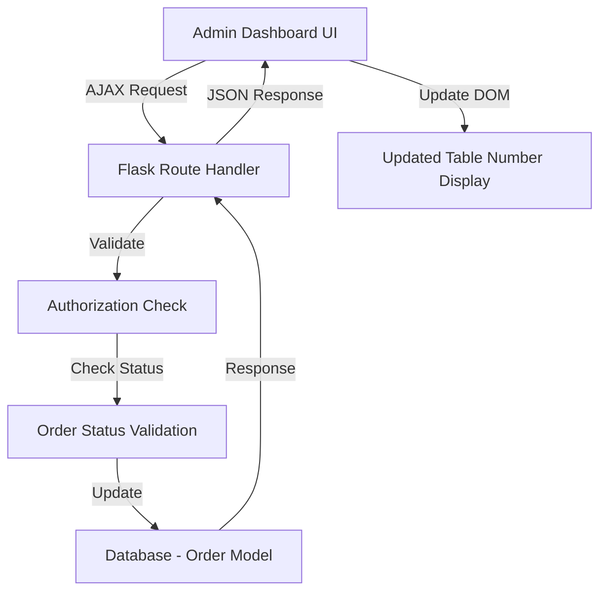

# Design Document: Table Number Reassignment

## Overview

This feature enables authorized staff (Cashier, Admin, Super Admin) to edit table numbers for pending dine-in orders through the admin dashboard. The implementation focuses on the core functionality: displaying table numbers in the order list, providing an inline edit interface, validating input, and restricting editing based on order status.

**Scope:** This is a minimal viable implementation that addresses the immediate operational need. Advanced features like bulk operations, audit trail, kitchen display integration, and mobile app changes are explicitly excluded from this phase.

**Key Design Decisions:**
- **Inline editing:** Table numbers are edited directly in the order list view using a simple click-to-edit pattern
- **Status-based locking:** Only PENDING orders can be edited; all other statuses are read-only
- **Client-side validation:** Input validation happens in the browser before submission to provide immediate feedback
- **AJAX updates:** Changes are submitted asynchronously to avoid page reloads
- **No audit trail:** Changes are not logged in this phase (can be added later if needed)

## Architecture

### System Components



### Component Responsibilities

1. **Admin Dashboard UI (Frontend)**
   - Display table numbers for dine-in orders
   - Provide inline edit controls for PENDING orders
   - Validate input client-side (positive integer)
   - Submit changes via AJAX
   - Display success/error feedback

2. **Flask Route Handler (Backend)**
   - Receive table number update requests
   - Enforce role-based access control
   - Validate order status (must be PENDING)
   - Validate table number (positive integer)
   - Update database
   - Return JSON response

3. **Database Layer**
   - Store table_number field in Order model (already exists)
   - Maintain data integrity through transactions

## Components and Interfaces

### Frontend Components

#### Order List View Enhancement

**Location:** `templates/admin/orders.html` (or equivalent)

**Changes Required:**
1. Add table number column to order list table
2. Display table number for dine-in orders
3. Show "N/A" for delivery/takeout orders
4. Add inline edit controls for PENDING dine-in orders

**HTML Structure:**
```html
<td class="table-number-cell" data-order-id="{{ order.id }}" data-status="{{ order.status }}" data-dining-option="{{ order.dining_option }}">
    
        
            <span class="table-number-display">{{ order.table_number or 'Not Set' }}</span>
            <button class="btn btn-sm btn-link edit-table-btn" title="Edit table number">
                <i class="fas fa-edit"></i>
            </button>
            <div class="table-number-edit-form" style="display: none;">
                <input type="number" class="form-control form-control-sm table-number-input" 
                       value="{{ order.table_number or '' }}" min="1" step="1">
                <button class="btn btn-sm btn-success save-table-btn">Save</button>
                <button class="btn btn-sm btn-secondary cancel-table-btn">Cancel</button>
            </div>
        
            <span class="table-number-readonly">{{ order.table_number or 'Not Set' }}</span>
        
    
        <span class="text-muted">N/A</span>
    
</td>
```

**JavaScript Functionality:**
```javascript
// Edit button click handler
$('.edit-table-btn').on('click', function() {
    const cell = $(this).closest('.table-number-cell');
    cell.find('.table-number-display').hide();
    cell.find('.edit-table-btn').hide();
    cell.find('.table-number-edit-form').show();
    cell.find('.table-number-input').focus();
});

// Cancel button handler
$('.cancel-table-btn').on('click', function() {
    const cell = $(this).closest('.table-number-cell');
    cell.find('.table-number-edit-form').hide();
    cell.find('.table-number-display').show();
    cell.find('.edit-table-btn').show();
});

// Save button handler
$('.save-table-btn').on('click', function() {
    const cell = $(this).closest('.table-number-cell');
    const orderId = cell.data('order-id');
    const input = cell.find('.table-number-input');
    const newTableNumber = parseInt(input.val());
    
    // Client-side validation
    if (!newTableNumber || newTableNumber < 1) {
        showError('Please enter a valid table number (positive integer)');
        input.focus();
        return;
    }
    
    // Submit via AJAX
    $.ajax({
        url: `/admin/orders/${orderId}/update-table`,
        method: 'POST',
        contentType: 'application/json',
        data: JSON.stringify({ table_number: newTableNumber }),
        success: function(response) {
            if (response.success) {
                cell.find('.table-number-display').text(newTableNumber);
                cell.find('.table-number-edit-form').hide();
                cell.find('.table-number-display').show();
                cell.find('.edit-table-btn').show();
                showSuccess(`Table number updated to ${newTableNumber}`);
            } else {
                showError(response.message || 'Failed to update table number');
            }
        },
        error: function(xhr) {
            const message = xhr.responseJSON?.message || 'Server error occurred';
            showError(message);
        }
    });
});

// Helper functions for notifications
function showSuccess(message) {
    // Display success toast/alert (auto-dismiss after 3 seconds)
    const alert = $('<div class="alert alert-success alert-dismissible fade show" role="alert">')
        .text(message)
        .append('<button type="button" class="close" data-dismiss="alert">&times;</button>');
    $('#notification-container').append(alert);
    setTimeout(() => alert.alert('close'), 3000);
}

function showError(message) {
    // Display error toast/alert (manual dismiss)
    const alert = $('<div class="alert alert-danger alert-dismissible fade show" role="alert">')
        .text(message)
        .append('<button type="button" class="close" data-dismiss="alert">&times;</button>');
    $('#notification-container').append(alert);
}
```

### Backend Components

#### New Flask Route

**Location:** `routes/admin/__init__.py`

**Route Definition:**
```python
@admin_bp.route('/orders/<int:order_id>/update-table', methods=['POST'])
@login_required
@admin_required
def update_order_table_number(order_id):
    """
    Update table number for a pending dine-in order.
    
    Request Body (JSON):
        {
            "table_number": <positive integer>
        }
    
    Returns:
        JSON response with success status and message
    """
    # Authorization check (already handled by @admin_required decorator)
    # Allowed roles: CASHIER, ADMIN, SUPER_ADMIN
    
    try:
        # Parse request data
        data = request.get_json()
        if not data or 'table_number' not in data:
            return jsonify({
                'success': False,
                'message': 'Missing table_number in request'
            }), 400
        
        new_table_number = data['table_number']
        
        # Validate table number is a positive integer
        try:
            new_table_number = int(new_table_number)
            if new_table_number < 1:
                raise ValueError()
        except (ValueError, TypeError):
            return jsonify({
                'success': False,
                'message': 'Table number must be a positive integer'
            }), 400
        
        # Fetch the order
        order = Order.query.get(order_id)
        if not order:
            return jsonify({
                'success': False,
                'message': 'Order not found'
            }), 404
        
        # Validate order is dine-in
        if order.dining_option != 'DINE_IN':
            return jsonify({
                'success': False,
                'message': 'Table number can only be updated for dine-in orders'
            }), 400
        
        # Validate order status is PENDING
        if order.status != 'PENDING':
            return jsonify({
                'success': False,
                'message': 'Table number can only be updated for pending orders'
            }), 400
        
        # Update the table number
        old_table_number = order.table_number
        order.table_number = new_table_number
        db.session.commit()
        
        # Return success response
        return jsonify({
            'success': True,
            'message': f'Table number updated from {old_table_number or "unset"} to {new_table_number}',
            'old_value': old_table_number,
            'new_value': new_table_number
        }), 200
        
    except Exception as e:
        db.session.rollback()
        print(f"Error updating table number for order {order_id}: {e}")
        traceback.print_exc()
        return jsonify({
            'success': False,
            'message': 'Internal server error'
        }), 500
```

#### Existing Route Modification

**Location:** `routes/admin/__init__.py` - `@admin_bp.route('/orders')` function

**Changes Required:**
- Ensure the order list query includes the `table_number` field
- Pass table number data to the template

**Example:**
```python
@admin_bp.route('/orders')
@login_required
@admin_required
def orders():
    # ... existing code ...
    
    # Ensure query includes table_number
    orders = Order.query.options(
        selectinload(Order.items),
        selectinload(Order.user)
    ).order_by(Order.created_at.desc()).all()
    
    # ... existing code ...
    
    return render_template('admin/orders.html', 
                         orders=orders,
                         # ... other context variables ...
                         )
```

## Data Models

### Order Model

**Location:** `models.py`

**Existing Schema (No Changes Required):**
```python
class Order(db.Model):
    id = db.Column(db.Integer, primary_key=True)
    user_id = db.Column(db.Integer, db.ForeignKey('user.id'), nullable=True)
    customer_name = db.Column(db.String(100), nullable=True)
    branch = db.Column(db.String(50), nullable=True, default='Pagsanjan')
    total_amount = db.Column(db.Numeric(10, 2), nullable=False)
    status = db.Column(db.String(20), default='PENDING', index=True)  # PENDING, PREPARING, COMPLETED, CANCELLED
    payment_status = db.Column(db.String(20), default='UNPAID')
    dining_option = db.Column(db.String(20), default='DINE_IN', index=True)  # DINE_IN, TAKE_OUT, DELIVERY
    payment_method = db.Column(db.String(20), default='COUNTER')
    table_number = db.Column(db.Integer, nullable=True)  # ← Already exists
    # ... other fields ...
```

**Notes:**
- The `table_number` field already exists in the Order model
- No database migration is required
- The field is nullable, which is appropriate (not all orders have table numbers)

## Error Handling

### Client-Side Validation Errors

| Error Condition | Error Message | Handling |
|----------------|---------------|----------|
| Empty input | "Please enter a valid table number (positive integer)" | Show error, keep focus on input |
| Non-numeric input | "Please enter a valid table number (positive integer)" | Show error, keep focus on input |
| Negative or zero | "Please enter a valid table number (positive integer)" | Show error, keep focus on input |

### Server-Side Validation Errors

| Error Condition | HTTP Status | Error Message | Handling |
|----------------|-------------|---------------|----------|
| Missing table_number | 400 | "Missing table_number in request" | Show error alert |
| Invalid table_number format | 400 | "Table number must be a positive integer" | Show error alert |
| Order not found | 404 | "Order not found" | Show error alert |
| Not a dine-in order | 400 | "Table number can only be updated for dine-in orders" | Show error alert |
| Order not PENDING | 400 | "Table number can only be updated for pending orders" | Show error alert, refresh order list |
| Database error | 500 | "Internal server error" | Show error alert |

### Authorization Errors

| Error Condition | HTTP Status | Handling |
|----------------|-------------|----------|
| User not authenticated | 302 | Redirect to login page (handled by @login_required) |
| User not authorized | 302 | Redirect to login with flash message (handled by @admin_required) |

### Concurrent Editing

**Scenario:** Two staff members try to edit the same order simultaneously.

**Handling:**
- Database transactions ensure sequential processing
- Last write wins (no optimistic locking in this simple implementation)
- If order status changes during editing, the update will fail with "Order status does not allow editing"
- User receives error message and can refresh to see current state

**Note:** For this simple implementation, we accept the last-write-wins behavior. If concurrent editing becomes a problem in practice, we can add optimistic locking in a future iteration.

## Testing Strategy

### Unit Tests

**Test File:** `tests/test_table_reassignment.py`

**Test Cases:**

1. **Test successful table number update**
   - Given: A PENDING dine-in order with table_number=5
   - When: Authorized staff updates table_number to 10
   - Then: Order.table_number is updated to 10, response is success

2. **Test validation: positive integer required**
   - Given: A PENDING dine-in order
   - When: Staff attempts to set table_number to 0, -1, or non-integer
   - Then: Request is rejected with 400 error

3. **Test authorization: only staff can edit**
   - Given: A PENDING dine-in order
   - When: A regular user (role='USER') attempts to update table_number
   - Then: Request is rejected with 403 error

4. **Test status restriction: only PENDING orders**
   - Given: Orders with status PREPARING, COMPLETED, CANCELLED
   - When: Staff attempts to update table_number
   - Then: Request is rejected with 400 error

5. **Test dining option restriction: only dine-in orders**
   - Given: Orders with dining_option DELIVERY or TAKE_OUT
   - When: Staff attempts to update table_number
   - Then: Request is rejected with 400 error

6. **Test order not found**
   - Given: Non-existent order ID
   - When: Staff attempts to update table_number
   - Then: Request is rejected with 404 error

7. **Test missing table_number in request**
   - Given: A PENDING dine-in order
   - When: Staff sends request without table_number field
   - Then: Request is rejected with 400 error

### Integration Tests

**Test Cases:**

1. **Test end-to-end table number update flow**
   - Create a PENDING dine-in order
   - Login as cashier
   - Navigate to orders page
   - Click edit button for table number
   - Enter new table number
   - Click save
   - Verify table number is updated in database
   - Verify success message is displayed

2. **Test UI state management**
   - Verify edit controls only appear for PENDING dine-in orders
   - Verify read-only display for completed orders
   - Verify "N/A" display for delivery/takeout orders

3. **Test error handling in UI**
   - Attempt to save invalid table number
   - Verify error message is displayed
   - Verify input field retains focus

### Manual Testing Checklist

- [ ] Table number column appears in order list
- [ ] Edit button appears only for PENDING dine-in orders
- [ ] Clicking edit button shows input form
- [ ] Clicking cancel button hides input form
- [ ] Entering invalid table number shows error
- [ ] Entering valid table number updates successfully
- [ ] Success message appears and auto-dismisses after 3 seconds
- [ ] Table number display updates without page reload
- [ ] Completed orders show read-only table number
- [ ] Delivery/takeout orders show "N/A"
- [ ] Unauthorized users cannot access the feature
- [ ] Regular users (customers) cannot edit table numbers

## Implementation Plan

### Phase 1: Backend Implementation

1. **Add new route handler** (`routes/admin/__init__.py`)
   - Implement `/admin/orders/<int:order_id>/update-table` endpoint
   - Add validation logic
   - Add error handling

2. **Modify existing orders route** (if needed)
   - Ensure table_number is included in query
   - Pass data to template

### Phase 2: Frontend Implementation

1. **Update order list template** (`templates/admin/orders.html`)
   - Add table number column
   - Add inline edit controls
   - Add conditional rendering based on status and dining option

2. **Add JavaScript functionality**
   - Implement edit/cancel/save handlers
   - Implement AJAX submission
   - Implement client-side validation
   - Implement notification display

3. **Add CSS styling** (if needed)
   - Style edit controls
   - Style notifications
   - Ensure responsive design

### Phase 3: Testing

1. **Write unit tests**
   - Test all validation rules
   - Test authorization
   - Test error handling

2. **Write integration tests**
   - Test end-to-end flow
   - Test UI interactions

3. **Perform manual testing**
   - Test in different browsers
   - Test with different user roles
   - Test edge cases

### Phase 4: Deployment

1. **Code review**
2. **Merge to main branch**
3. **Deploy to staging environment**
4. **Perform smoke testing**
5. **Deploy to production**
6. **Monitor for errors**

## Future Enhancements (Out of Scope for This Phase)

The following features are explicitly excluded from this implementation but can be added in future iterations:

1. **Audit Trail** (Requirement 7)
   - Track who changed table numbers and when
   - Display change history for each order

2. **Bulk Table Reassignment** (Requirement 9)
   - Select multiple orders
   - Update all selected orders to new table number

3. **Kitchen Display Integration** (Requirement 10)
   - Real-time notifications to kitchen display
   - Highlight updated orders

4. **Mobile App Integration** (Requirement 12)
   - Display table number in mobile app
   - Real-time updates when staff changes table number
   - Push notifications for table changes

5. **Optimistic Locking** (Requirement 8 enhancement)
   - Prevent concurrent editing conflicts
   - Version-based updates

6. **Table Availability Tracking**
   - Validate table number against available tables
   - Prevent assigning occupied tables

These features can be prioritized and implemented based on user feedback and operational needs after the core functionality is deployed and validated.
