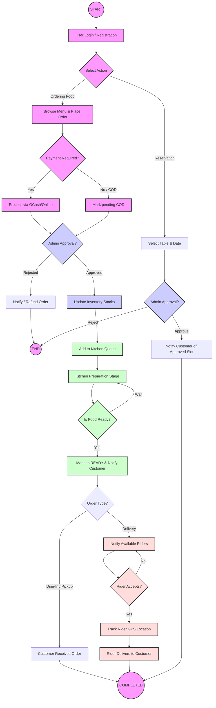

# System Documentation: Le Maison - Yelo Lane

This document contains the core system specifications, including the Test Plan, Input-Process-Output (IPO) model, and the System Flowchart.

---

## 1. Admin Page Test Plan

| Case No. | Test Plan | Description |
| :--- | :--- | :--- |
| 1.0 | Login | Ensure admins can log in with valid credentials and are denied access with invalid ones. Verify secure handling of failed attempts and availability of password recovery. |
| 2.0 | Forget Password | To authenticate whether administrators can recover their accounts via OTP verification in the event of forgetting their password. |
| 3.0 | Dashboard (Overview) | Confirm the dashboard loads properly, displays real-time data in widgets like Total Sales, Active Orders, Pending Reservations, and Recent System Activity. |
| 4.0 | Orders Management | Check access to the orders module. Verify the functionality of order listings, search/filter options, viewing detailed receipts, and updating processing statuses. |
| 5.0 | Walk-in Order (POS) | Validate that the Walk-in Order module functions correctly as a point of sale, allowing staff to select items, calculate totals, and process payments on-site. |
| 6.0 | Kitchen Display | Verify the Kitchen module shows incoming orders clearly, allowing kitchen staff to reliably mark items as "preparing" or "ready" in real-time. |
| 7.0 | Deliveries Tracking | Confirm the deliveries module loads correctly. Ensure the Admin can monitor assigned riders on the map and view live delivery status updates. |
| 8.0 | Reservations | Validate that the Admin can view, approve, reject, or modify customer table reservations and that status changes trigger proper user notifications. |
| 9.0 | Menu Management | Verify the Admin can add, edit, or remove food items and categories, and ensure that changes reflect instantly on the customer-facing web and mobile apps. |
| 10.0 | Inventory | Check access to the inventory module. Validate the ability to track ingredient stock levels, update quantities, and flag low-stock items. |
| 11.0 | User Approvals | Verify the Admin can manage registered accounts, approve or reject rider/staff access requests, and block or unblock user accounts. |
| 12.0 | Reviews | Check that the Admin can view and filter customer reviews and feedback securely from the system interface. |
| 13.0 | Analytics | Confirm that the analytics page accurately renders charts, sales reports, and historical data trends without loading errors. |
| 14.0 | Settings | Validate that global system settings (such as shop hours, contact details, or notification preferences) can be modified and saved properly. |

---

## 2. Cashier Page Test Plan

| Case No. | Test Plan | Description |
| :--- | :--- | :--- |
| **1.0** | **View Live Orders** | Monitor real-time status of all PENDING, PREPARING, and READY orders. |
| **2.0** | **Create Walk-in Orders** | Manually input and process orders for on-site customers. |
| **3.0** | **Process Payments** | Update payment status from UNPAID to PAID and select payment methods. |
| **4.0** | **Generate Receipts** | Produce and print itemized receipts for completed transactions. |
| **5.0** | **View Order History** | Access paginated records of all past transactions and sales data. |
| **6.0** | **Customer Messaging** | Access and respond to real-time customer inquiries via the chat portal. |

---

## 3. Kitchen Side Test Plan

| Case No. | Test Plan | Description |
| :--- | :--- | :--- |
| **1.0** | **Staff Log In** | Securely access the kitchen portal using staff credentials (KITCHEN/STAFF/ADMIN roles). |
| **2.0** | **Order Queue Dashboard** | View live incoming orders categorized by status: Pending, Preparing, and Ready for Pickup. |
| **3.0** | **Update Order Status** | Transition orders through preparation stages (e.g., from PENDING to PREPARING or READY). |
| **4.0** | **Ingredient Auto-Deduction** | Verify that moving an order to "Preparing" automatically deducts required ingredients from kitchen stock. |
| **5.0** | **Kitchen Pantry Management** | View and manually adjust current kitchen stock levels for all ingredients. |
| **6.0** | **Recipe Reference** | View itemized ingredient lists for all menu items to ensure preparation accuracy. |
| **7.0** | **Stock Requests** | Submit and monitor requests to the warehouse for ingredient replenishment. |
| **8.0** | **Real-time Notifications** | Receive instant socket alerts for new orders and status updates across the system. |
| **9.0** | **Logout** | Securely terminate the session and return to the kitchen login screen. |

---

## 4. Input-Process-Output (IPO) Model

| **INPUT** | **PROCESS** | **OUTPUT** |
| :--- | :--- | :--- |
| **User Data** • Login Credentials • Customer Profile • Account Registration | **Authentication & Security** • User login verification • Account authorization • Data Encryption | **Access Control** • Authorized user access • Encrypted user credentials |
| **Ordering & POS** • Selected Menu Items • Order Type • Customer Details • Payment Info | **Order Lifecycle Management** • Real-time order calculation • Stock level deduction • Order queuing • Payment processing | **Order fulfillment** • Generated Digital Receipt • Printed QR or Order IDs • Transaction records |
| **Reservations** • Date and Time • Table Selection / Pax • Downpayment details | **Reservation Handling** • Availability checking • Table assignment logic • Booking approval/rejection | **Booking Confirmation** • Status notification • Daily reservation master list |
| **Kitchen Preparation** • New incoming orders • Preparation estimates | **Kitchen Queue Management** • Real-time notifications • Status categorization | **Production Feedback** • Real-time update to Customer • Served status for staff |
| **Deliveries (Riders)** • GPS location • Delivery proof • Rider acceptance | **Logistics Tracking** • Calculating delivery routes • Map visualization • Fee calculation | **Delivery Receipt** • "Order Delivered" status • Tracked rider location |
| **Inventory & Supply** • Stocks to be added • Critical stock alerts | **Inventory Tracking** • Real-time stock deduction • Monitoring expiration / cost | **Stock Reports** • Low stock notifications • Automated inventory logs |
| **Analytics & Feedback** • Transaction logs • Customer Reviews | **Data Compilation** • Sales report generation • Top-selling items calculation • Sentiment analysis | **System Reports** • Sales performance graphs • Business insight reports |

---

## 5. System Flowchart

